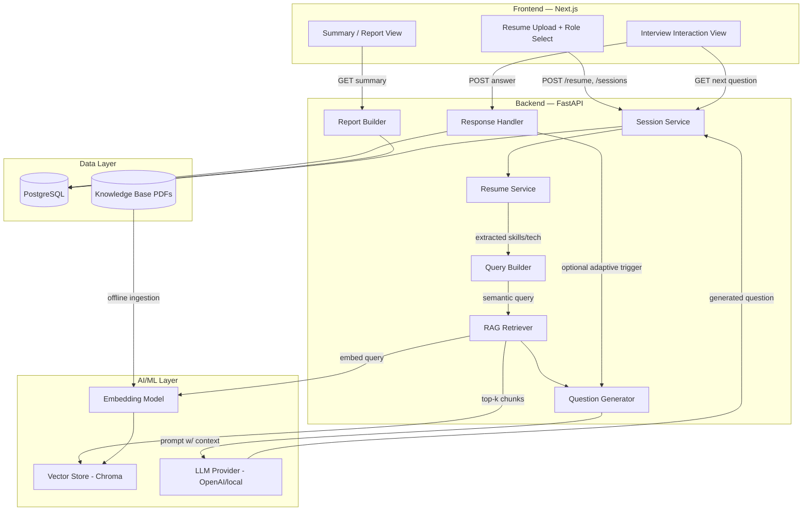
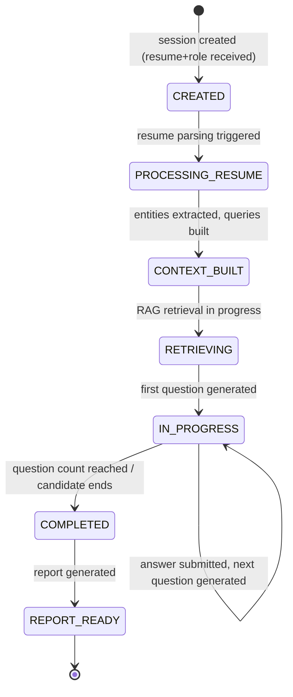
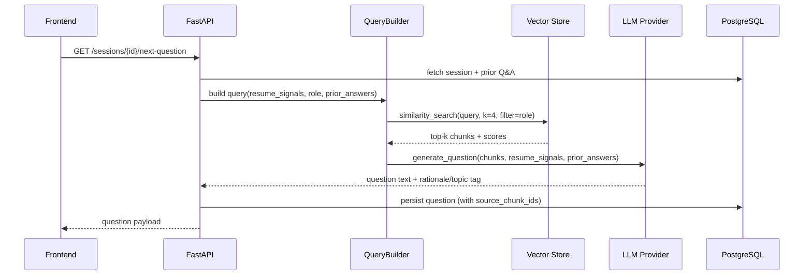

# System Architecture

## 1. High-Level Overview

## 2. Component Responsibilities

### 2.1 Frontend (Next.js)
- **Resume Upload + Role Select (`app/page.tsx`)**: uploads file to `/resume`, POSTs to
  `/sessions` to create an interview session, then routes to `/interview/[sessionId]`.
- **Interview Interaction (`app/interview/[sessionId]`)**: polls/fetches the current question,
  submits answers, shows progress (question N of M), manages local state via a Zustand store
  so page refreshes don't lose in-flight answers (server is still source of truth).
- **Summary View (`app/summary/[sessionId]`)**: renders the structured report — topics
  covered, Q&A transcript, and basic per-answer insight (relevance flag, is-empty flag, etc.).

### 2.2 Backend (FastAPI)
Organized by **service layer** rather than by CRUD-per-model, matching the assignment's request
to think in terms of "logical API design and request flow" rather than raw endpoints:

| Service               | Responsibility                                                        |
|------------------------|-------------------------------------------------------------------------|
| `SessionService`       | Create/track interview sessions, enforce lifecycle state machine       |
| `ResumeService`        | Parse uploaded resume, extract structured signals (skills, tech, years)|
| `QueryBuilderService`  | Turn (resume signals + role) into 1..N retrieval queries               |
| `RAGRetriever`         | Embed queries, fetch top-k chunks per query from the role's collection |
| `QuestionGenerator`    | Prompt the LLM with retrieved context + resume signals → question(s)   |
| `ResponseHandler`      | Persist Q&A pairs, optionally trigger adaptive follow-up generation    |
| `ReportBuilder`        | Aggregate session Q&A into a structured summary + lightweight insights |

### 2.3 AI/ML Layer
- **Embedding Model**: local `sentence-transformers` model — no external API cost/latency for
  every retrieval call, deterministic, easy to run in CI.
- **Vector Store**: Chroma, one collection per role (`kb_backend_engineer`,
  `kb_ai_ml_engineer`, ...), populated offline via the ingestion script.
- **LLM Provider**: interface-driven (`app/llm/base.py`) so the concrete provider (OpenAI,
  Anthropic, local Ollama model) is a config swap, not a code change.

### 2.4 Data Layer
- **PostgreSQL**: sessions, resumes (parsed metadata only, not raw file), questions, answers,
  reports. See `DATABASE_SCHEMA.md`.
- **Knowledge Base PDFs**: the provided textbooks, stored on disk (or object storage in
  production), ingested once into the vector store — not re-parsed per request.

## 3. Interview Lifecycle (State Machine)

Persisting this state on the `sessions.status` column lets the frontend safely resume an
in-progress interview after a refresh, and lets the backend reject out-of-order requests
(e.g., submitting an answer to a session that's already `COMPLETED`).

## 4. End-to-End Request Flow (Single Question Cycle)

## 5. Modularity & Separation of Concerns

- **API routers** contain no business logic — they validate input (Pydantic schemas) and
  delegate to services.
- **Services** contain orchestration logic and are framework-agnostic (no FastAPI imports),
  making them independently unit-testable.
- **RAG internals** (`app/rag/*`) and **LLM access** (`app/llm/*`) are isolated behind
  interfaces so either can be swapped (different vector DB, different model provider) without
  touching services or routers.
- **Configuration** is centralized in `app/core/config.py` via `pydantic-settings`, reading
  from environment variables — no hardcoded secrets or paths.

## 6. Error Handling & Validation Strategy

- Pydantic schemas validate all request bodies at the API boundary (file type/size for resume
  upload, role must be one of a known enum, session id must be a valid UUID).
- A global FastAPI exception handler maps internal exceptions to structured error responses:
  `{"error_code": "...", "message": "...", "details": {...}}` with appropriate HTTP status
  (400 validation, 404 not found, 409 invalid state transition, 502 upstream LLM/embedding
  failure, 500 unexpected).
- Retrieval and generation calls are wrapped with retry-with-backoff (max 2 retries) for
  transient LLM/embedding API failures; a graceful fallback question bank is used only as a
  last resort so the demo never hard-fails during a live session.

## 7. Non-Goals / Explicit Scope Boundaries

To keep the 48-hour scope realistic, the following are intentionally out of scope for v1 and
called out here rather than silently skipped:
- Multi-user auth/accounts (sessions are accessed via an unguessable session UUID URL).
- Horizontal scaling / distributed task queues (single-process FastAPI is sufficient for the
  assignment's demo scale).
- Fine-tuned or custom-trained models — the assignment calls for applied RAG, not model
  training.
