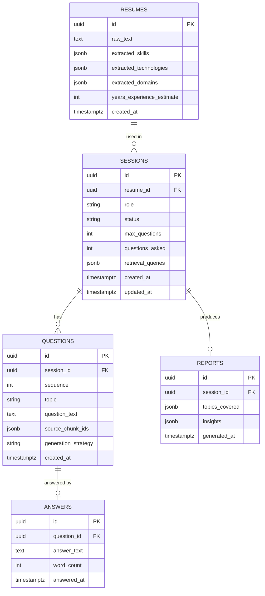

# Database Schema

Relational store: PostgreSQL. Vector store (Chroma) holds embeddings/chunks separately — see
`RAG_PIPELINE.md`; the two are linked via `chunk_id` strings referenced from `questions`.

## 1. Entity-Relationship Diagram



## 2. Table Notes

### `resumes`
- Stores **extracted structured data**, not the raw uploaded file (the file itself, if
  retained, lives in object storage / local disk with only a path reference — avoids bloating
  the DB with binary blobs).
- `extracted_skills` / `extracted_technologies` / `extracted_domains` are `jsonb` arrays —
  flexible schema since resume content varies widely, while still queryable via Postgres JSON
  operators if needed later (e.g., "how many sessions mention Kubernetes").

### `sessions`
- `status` is an enum-backed string matching the state machine in `ARCHITECTURE.md §3`
  (`CREATED`, `PROCESSING_RESUME`, `CONTEXT_BUILT`, `RETRIEVING`, `IN_PROGRESS`, `COMPLETED`,
  `REPORT_READY`). Enforced at the application layer via a transition-validation function so
  invalid jumps (e.g., `CREATED → COMPLETED`) are rejected with `409`.
- `retrieval_queries` stores the actual queries the `QueryBuilderService` generated — kept for
  traceability/debugging and for the demo video ("here's exactly what we searched for and
  why").

### `questions`
- `source_chunk_ids` is the traceability field required by the assignment (§7.5): a JSON array
  of vector-store chunk identifiers (`"kb_backend_engineer::chunk_0231"`) that produced this
  question, so every question can be traced back to grounding text.
- `generation_strategy` records whether the question was `"initial"` (from resume+role only)
  or `"adaptive"` (also conditioned on a prior answer) — makes the optional adaptive-questioning
  feature auditable rather than invisible.

### `answers`
- One-to-one with `questions` (a question is answered at most once; a new adaptive question is
  a *new row* in `questions`, not an edit) — keeps the full Q&A history immutable and simple to
  render as a transcript.
- `word_count` is precomputed at write-time to make basic report insights (e.g., "thin
  answers") cheap to compute without re-parsing text at report time.

### `reports`
- One-to-one with `sessions`. Generated once, on session completion, and cached — the
  `GET /sessions/{id}/report` endpoint is a read of this row, not a recomputation, so repeated
  views are fast and consistent.

## 3. Indexes

```sql
CREATE INDEX idx_sessions_resume_id ON sessions(resume_id);
CREATE INDEX idx_questions_session_id ON questions(session_id);
CREATE INDEX idx_answers_question_id ON answers(question_id);
CREATE UNIQUE INDEX uq_reports_session_id ON reports(session_id);
CREATE INDEX idx_sessions_status ON sessions(status);
```

`idx_sessions_status` supports an ops/admin query pattern ("show all IN_PROGRESS sessions") and
is cheap given low write volume per session.

## 4. Migrations

Managed via Alembic (`backend/app/db/migrations/`). Each schema change is a versioned,
reviewable migration file rather than `create_all()` — the assignment explicitly rewards
"system design maturity," and versioned migrations are a concrete, checkable signal of that.
