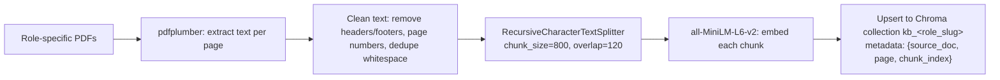

# RAG Pipeline Design

This is the core AI/ML component of the system (assignment §6/§7). It's split into four
stages, matching the assignment's structure: **Ingestion → Retrieval → Question Generation →
Resume Utilisation & Output Structuring.**

## 1. Knowledge Ingestion (Offline, One-Time per Role)

**Script**: `backend/scripts/ingest_knowledge_base.py`



**Design choices:**
- **Chunk size 800 chars / overlap 120**: large enough to preserve a full concept/paragraph
  from a textbook (avoids splitting a definition from its explanation), small enough to keep
  retrieval precise (a chunk that's "the whole chapter" would defeat the purpose of retrieval).
  Overlap ensures ideas that straddle a chunk boundary aren't lost entirely from either chunk.
- **Recursive splitting** (paragraph → sentence → word, in that priority order) instead of
  fixed-length slicing: preserves semantic units, directly addressing the "context
  preservation" expectation in §7.1.
- **Metadata per chunk** (`source_doc`, `page`, `chunk_index`) is what makes traceability
  possible later — every generated question can cite exactly which page of which textbook
  grounded it.
- **One Chroma collection per role**: retrieval is naturally scoped (a Backend Engineer session
  never accidentally retrieves ML theory chunks), and re-ingesting one role's KB never touches
  another's collection.
- **Idempotent ingestion**: chunk IDs are deterministic hashes of `(source_doc, chunk_index)`,
  so re-running ingestion after adding a new PDF only adds new chunks rather than duplicating
  existing ones.

## 2. Retrieval Mechanism

### 2.1 Query Construction (`QueryBuilderService`)

Rather than sending the role name alone as a query (which the assignment explicitly warns
against — "avoid generic or template-driven outputs"), queries are constructed from:

```
query = f"{role_context_phrase} — candidate background: {', '.join(top_resume_signals)}. Focus: {topic_slot}"
```

Where:
- `role_context_phrase` is a short static phrase per role (e.g., "core backend engineering
  concepts including APIs, databases, and system design").
- `top_resume_signals` are the extracted skills/technologies most relevant to that role
  (ranked by a simple relevance score against a per-role keyword taxonomy).
- `topic_slot` rotates across a per-role topic checklist (e.g., for Backend Engineer:
  `["API design", "databases", "caching", "concurrency", "system design", "testing"]`) so the
  interview naturally covers breadth rather than drilling one lucky retrieval result repeatedly.

This produces **N distinct queries per session** (one per topic slot, up to `max_questions`),
each independently embedded and searched — this is the concrete mechanism behind "generate
meaningful queries" and "identify relevant topics or domains to evaluate" in the assignment.

### 2.2 Similarity Search

```python
def retrieve(query: str, role: str, k: int = 4) -> list[Chunk]:
    query_embedding = embedder.encode(query)
    return vector_store.query(
        collection=f"kb_{role}",
        query_embedding=query_embedding,
        k=k,
    )
```

- `k=4` balances enough grounding context for the LLM against prompt bloat/noise.
- Results below a minimum cosine-similarity threshold (0.35, tunable via env var) are dropped
  and the topic slot is retried with a rephrased query once before falling back to a
  next-best topic — this is what "ensure retrieved content is meaningful and grounded" means
  concretely, rather than blindly forwarding whatever comes back.

## 3. Question Generation

**Prompt structure** sent to the LLM (`app/services/question_generator.py`):

```
System: You are a senior technical interviewer for the role of {role_label}. Ask exactly ONE
question. It must be answerable using solid understanding of the provided context, and should
require the candidate to explain reasoning, not just recall a fact. Do not repeat earlier
topics: {topics_already_asked}.

Context (retrieved from reference material):
{retrieved_chunks_joined}

Candidate background signals:
{resume_signals}

{OPTIONAL if adaptive: Candidate's previous answer, for calibrating depth/follow-up: "{prev_answer}"}

Return strictly as JSON: {"topic": "...", "question": "..."}
```

- **Structured JSON output** (parsed with a Pydantic schema, with a repair-retry on malformed
  JSON) keeps `topic` and `question_text` separately storable and avoids brittle regex parsing
  of free text.
- **Explicit "do not repeat earlier topics"** instruction, backed by passing
  `topics_already_asked` from the session's question history, is the concrete mechanism
  ensuring breadth across an interview rather than five variations of the same question.
- **Depth/difficulty modulation**: if `years_experience_estimate` (from resume parsing) is
  higher, the system prompt appends "candidate has ~{N} years experience — favor
  applied/design-tradeoff questions over textbook-definition questions"; for junior profiles it
  favors foundational-but-still-reasoning questions. This is the concrete implementation of
  §7.4 ("resume should influence topic selection, question difficulty, direction").

## 4. Adaptive Follow-Up (Optional Enhancement)

When `ADAPTIVE_MODE=true`:
- After an answer is stored, a lightweight heuristic checks: answer word count, and whether
  key terms from the retrieved chunk appear in the answer (simple term-overlap, not semantic
  scoring, to keep this fast and explainable).
- If the answer looks thin (< 15 words or near-zero term overlap), the **next** question stays
  on the same topic slot but is generated with the previous Q&A pair included in the prompt,
  asking a clarifying/simpler question on the same concept.
- If the answer looks strong, the next question moves to a new topic slot, optionally raising
  difficulty framing.

This is intentionally a heuristic rather than a trained classifier — appropriate for the
assignment's scope, explainable in the demo video, and clearly labeled as an extension rather
than core functionality (per §8, "Creativity & Extensions").

## 5. Output Structuring & Traceability (§7.5)

Every stage's output is persisted so the full chain is reconstructable after the fact:

```
resume.extracted_skills
        │
        ▼
session.retrieval_queries[i]  ──► (chunk_ids, scores)  [not persisted row-by-row; logged + top-k IDs stored]
        │
        ▼
questions.source_chunk_ids[i] ──► questions.question_text[i]
        │
        ▼
answers.answer_text[i]
        │
        ▼
reports.transcript[i]  (question + answer + topic + source_chunk_ids, re-surfaced verbatim)
```

Because `source_chunk_ids` rides along from generation through to the final report, a reviewer
(or the candidate) can always answer "why was I asked this?" — directly satisfying the
assignment's explicit call for traceability.

## 6. Failure Modes & Guardrails

| Failure | Handling |
|---|---|
| Retrieval returns no chunks above threshold | Retry with a rephrased query once, then fall back to the next topic slot in the checklist |
| LLM returns malformed JSON | One repair retry with an explicit "return valid JSON only" reminder; after 2 failures, use a hand-written fallback question for that topic slot (logged as `generation_strategy = "fallback"`) so a live demo never stalls |
| Embedding/LLM API timeout | Retry with exponential backoff (max 2 retries); surfaced to frontend as a transient "generating your next question..." state, not a hard error, unless retries are exhausted (`502`) |
| Resume yields no extractable skills (e.g., scanned image PDF) | Falls back to role-generic questions only; report flags "resume signals limited — evaluation is role-generic" for transparency rather than silently pretending personalization occurred |
